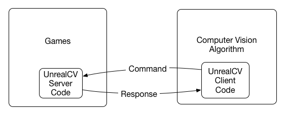

# Setup

This document provides instructions on how to set up the project on your local machine. 

### Install Unreal Engine

Download and install Unreal Engine from the [official website](https://www.unrealengine.com/en-US/download). This project was developed using Unreal Engine 4.27.2 but should work with other versions as well. Create a new project, some sample provided by Epic are available in the launcher marketplace.

### Install UnrealCV

UnrealCV is divided in two parts: the Unreal Engine plugin and the Python client. The Unreal Engine plugin is a server embedded in the game, and the UnrealCV client sends commands to the server to control the game and receive images.

<figure>
    
    <figcaption>Architecture of UnrealCV.</figcaption>
</figure>

UnrealCV provides compiled binary for the Unreal Engine plugin but are only compatible with Unreal Engine 4.17. To use UnrealCV with another version of unreal engine, you need to compile the plugin from source.

1. Clone the UnrealCV repository from GitHub:

```bash
git clone https://github.com/unrealcv/unrealcv.git
cd unrealcv
```

2. Checkout the branch for your Unreal Engine version. For example, if you are using Unreal Engine 4.27 you can checkout the 4.27-stable branch.

```bash
git checkout 4.27-stable
```

3. If you are on Windows, make sure to have the latest .NET framework installed.

4. Install the UnrealCV python package:

```bash
pip install -U unrealcv
```

5. Compile the UnrealCV plugin:

```bash
python build.py
```

If this script fails to find UE installation path, you can also manually specify the engine path

```bash
python build.py --UE4 "/Users/Shared/Epic Games/UE_4.27"
```

6. Now the plugin is compiled, you can install it to your Unreal Engine project. Copy the `Plugins/UnrealCV` folder to your Unreal Engine project's `Plugins` folder. If you want to install the plugin globally, you can copy the `Plugins/UnrealCV` folder to the `Engine/Plugins` folder of your Unreal Engine installation.

7. Enable the UnrealCV plugin in your Unreal Engine project. Open your project in Unreal Engine, go to `Edit > Plugins`, search for `UnrealCV`, and enable the plugin. This will require you to restart the editor.

The UnrealCV plugin is now installed in your Unreal Engine project!

### Check the installation

To check if the plugin is correctly installed, open a python terminal and run the following commands:

```python
import sys
from unrealcv import client

# Connect to the plugin
client.connect()
if not client.isconnected():
    print('UnrealCV server is not running. Run the game first.')
    sys.exit(-1)

# Get the status of UnrealCV plugin
res = client.request('vget /unrealcv/status')
print(res)
```
Should return something like this:

```
Is Listening
Client Connected
9000
Configuration
Config file: /Users/qiuwch/unrealcv/UE4Binaries/RealisticRendering/MacNoEditor/RealisticRendering.app/Contents/UE4/Engine/Binaries/Mac/unrealcv.ini
Port: 9000
Width: 640
Height: 480
FOV: 90.000000
EnableInput: true
EnableRightEye: false
```
