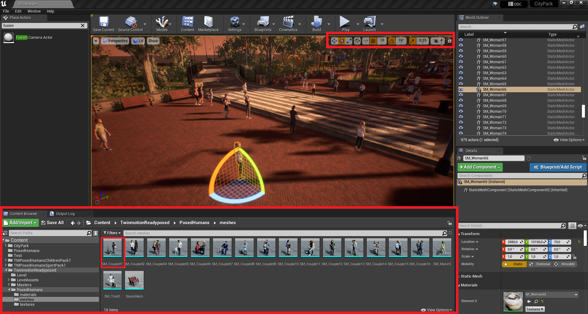
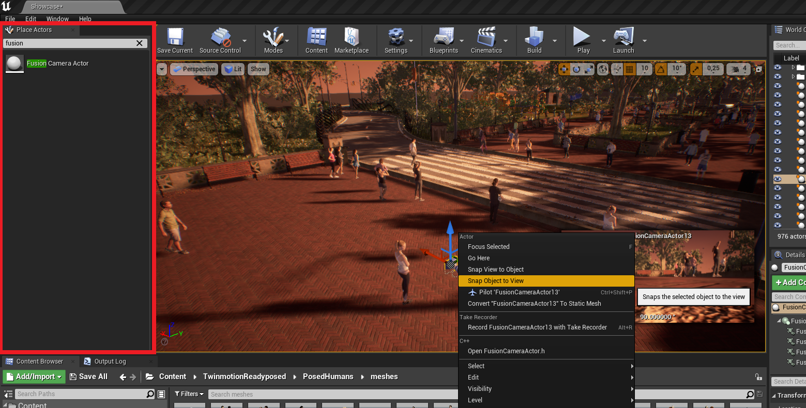
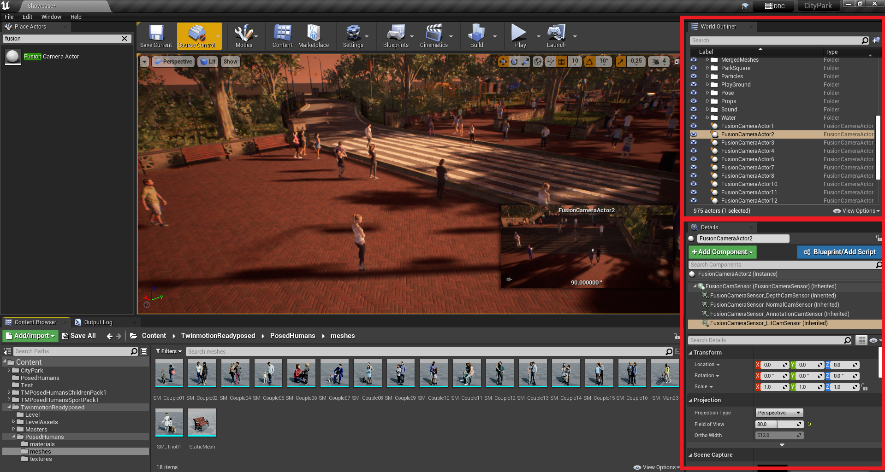
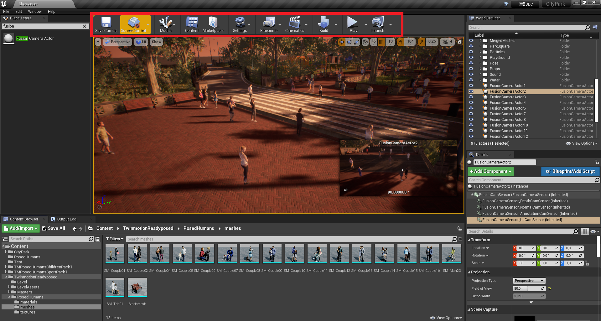

Building an entire game in Unreal Engine 4 (UE4) from scratch is not a trivial task. It requires a lot of time, effort, and a good machine to run the engine properly : ).

For the purpose of this project I will be using a pre-built project called [city park environment collection](https://www.unrealengine.com/marketplace/en-US/product/city-park-environment-collection-lite). This project is available for free on the Unreal Engine marketplace and provides a realistic 3D environment that resembles a city park. From the marketplace I also downloaded some human poses provided by Unreal.

The final goal is to create a realistic city park environment populated with human characters in different poses. Cameras from the UnrealCV plugin will be place on light poles to capture images like a surveillance camera.

The first step is to download from the marketplace the human poses and the city park project and open it in Unreal Engine. The project will look something like this:

To place a new object in the scene, use the Content Browser, highlighted in the image below. To find a specific object, you can use the search bar or browse the folders on the left. Once you have found the object, you can drag and drop it from the Content Browser to place it in the scene.

To change rotation or position of an object you can use the transform tool located in the top right.

To add an UnrealCV camera to the scene you can use the Place Actors panel. Search for "Fusion Camera Actor" and drag it to the scene. If you want to place the camera where the player is, you can right-click on the camera and select "Snap object to View".

On the right of the screen, you can see the World Outliner panel. This panel shows all the objects in the scene. You can select an object by clicking on it in the World Outliner or in the scene. Once an object is selected, you can change its properties in the Details panel on the right.

In the details panel you can change the properties of the cameras and the lighting of the scene.

To save the project or play the level you can use the buttons on the top of the screen.

